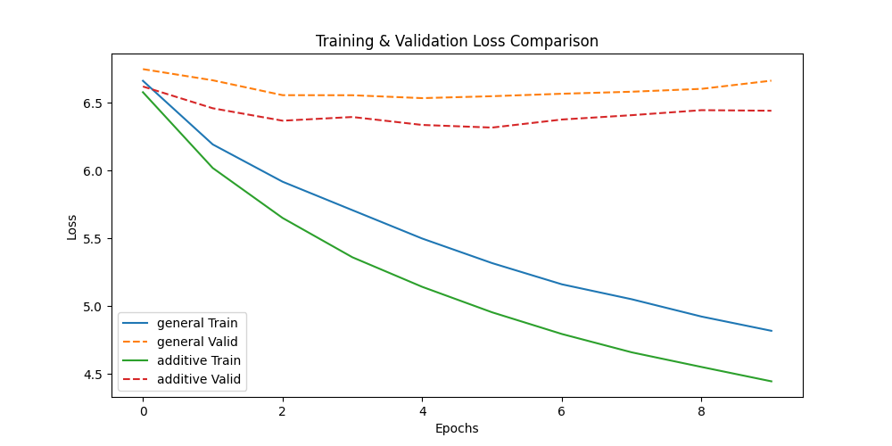
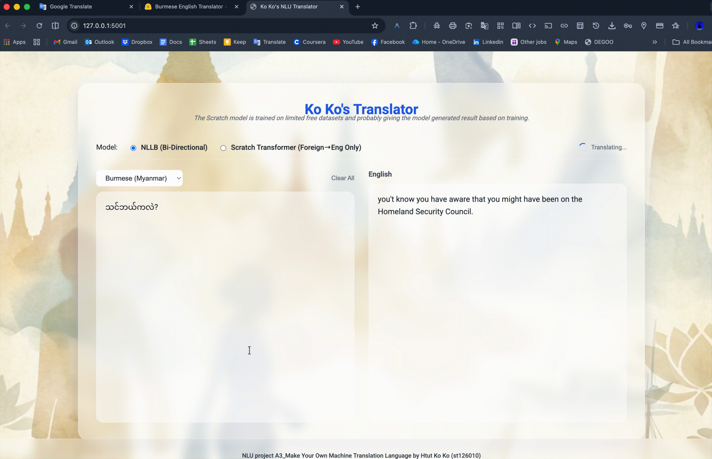

# Multilingual Neural Machine Translation (Project A3)

**Developed by:** Htut Ko Ko (st126010)

* 👉  **Live App** : [huggingface.co/spaces/shadowsilence/burmese-english-translator](https://huggingface.co/spaces/shadowsilence/burmese-english-translator)

This project implements high-quality machine translation systems for multiple languages (Burmese, Thai, Chinese, Vietnamese, Hindi, Nepali, Urdu, Tagalog, Kazakh, Bengali, German) to English using two approaches:

1. **Fine-Tuned NLLB-200**: State-of-the-art multilingual model tailored for high-quality translation across all supported languages.
2. **Transformer from Scratch**: Educational implementation to demonstrate understanding of NMT architecture.

## Experiments



### Attention Mechanisms (Burmese-English)

I compared **General (Dot Product)** and **Additive (Bahdanau)** attention mechanisms using a Seq2Seq GRU model.

| Attention Mechanism           | Training Loss   | Training PPL     | Validation Loss | Validation PPL    |
| ----------------------------- | --------------- | ---------------- | --------------- | ----------------- |
| General (Dot)                 | 4.819           | 123.868          | 6.662           | 782.166           |
| **Additive (Bahdanau)** | **4.447** | **85.368** | **6.440** | **626.673** |

**Observation:** Additive Attention achieved lower validation perplexity, indicating better performance.

## Demo



## Folder Structure

- `Burmese_English_NLLB.ipynb`: **(Recommended)** Fine-Tuning NLLB for high-quality translation.
- `Burmese_English_Transformer.ipynb`: Transformer from Scratch implementation for Burmese-English.
- `*_English_Transformer.ipynb`: Transformer implementation for Foreign_language_for_AIT_students-English.
- `Attention_Experiments.ipynb`: Comparison of General vs. Additive Attention (Burmese-English).
- `app/`: Web Application folder.
  - `app.py`: Flask application supporting multiple languages.
  - `nllb_model/`: Fine-tuned NLLB model.

## How to Run Locally

### 1. Requirements

Install dependencies:

```bash
cd app
pip install -r requirements.txt
```

### 2. Run the App

```bash
python app.py
```

Open `http://localhost:5001`.

## Credits & Acknowledgements

This project respects the academic integrity and usage policies of the following resources:

- **Dataset**: [Asian Language Treebank (ALT)](https://www2.nict.go.jp/astrec-att/member/mutiyama/ALT/), [Opus-100](https://opus.nlpl.eu/)
- **Base Model**: [NLLB-200](https://ai.meta.com/research/no-language-left-behind/) by Meta AI.
- **Tokenization**: [SentencePiece](https://github.com/google/sentencepiece) by Google.
