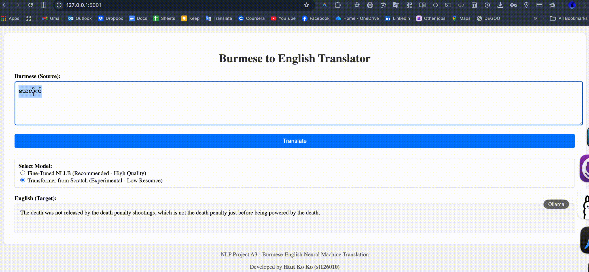

# Burmese-English Neural Machine Translation (Project A3)

**Developed by:** Htut Ko Ko (st126010)

* 👉  **Live App** : [huggingface.co/spaces/shadowsilence/burmese-english-translator](https://huggingface.co/spaces/shadowsilence/burmese-english-translator)

This project implements a high-quality Burmese-to-English translation system using two approaches:

1. **Fine-Tuned NLLB-200**: State-of-the-art multilingual model tailored for this task. (High Quality)
2. **Transformer from Scratch**: Educational implementation to demonstrate understanding of NMT architecture. (Experimental)

## Demo



## Folder Structure

- `Burmese_English_NLLB.ipynb`: **(Recommended)** Fine-Tuning NLLB for high-quality translation.
- `Burmese_English_Transformer.ipynb`: Transformer from Scratch implementation.
- `app/`: Web Application folder.
  - `app.py`: Flask application.
  - `nllb_model/`: Fine-tuned NLLB model (Excluded from Git due to size).

## How to Run Locally

### 1. Requirements

Install dependencies:

```bash
cd app
pip install -r requirements.txt
```

### 2. Run the App

```bash
python app.py
```

Open `http://localhost:5001`.

## Credits & Acknowledgements

This project respects the academic integrity and usage policies of the following resources:

- **Dataset**: [Asian Language Treebank (ALT)](https://www2.nict.go.jp/astrec-att/member/mutiyama/ALT/)
- **Base Model**: [NLLB-200](https://ai.meta.com/research/no-language-left-behind/) by Meta AI.
- **Tokenization**: [SentencePiece](https://github.com/google/sentencepiece) by Google.
